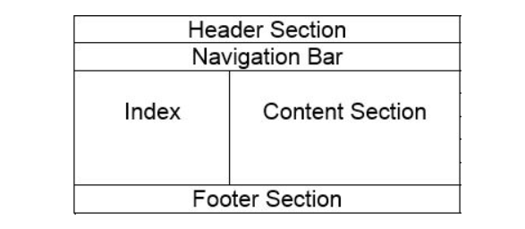

# HTML

## Table of Contents

| No. | Question                                                                                                                  |
| --- | ------------------------------------------------------------------------------------------------------------------------- |
| 1.  | [What is HTML?](#what-is-html)                                                                                            |
| 2.  | [What is Differences between HTML Element and tags?](#what-is-difference-between-html-element-and-tags)                   |
| 3.  | [What is HTML attributes?](#what-is-html-attributes)                                                                      |
| 4.  | [What is Block level elements?](#what-is-block-level-elements)                                                            |
| 5.  | [What is Inline elements?](#what-is-inline-elements)                                                                      |
| 6.  | [Why we use Comments in HTML?](#why-we-use-comments-in-html)                                                              |
| 7.  | [How to create Hyperlinks in HTML?](#how-to-create-hyperlinks-in-html)                                                    |
| 8.  | [Name Some Common lists that are used when designing a page](#name-some-common-lists-that-are-used-when-designing-a-page) |
| 9.  | [What is an Image map](#what-is-an-image-map)                                                                             |
| 10. | [What is Style Sheet?](#what-is-style-sheet)                                                                              |
| 11. | [Explain the layout of HTML](#explain-the-layout-of-html)                                                                 |
| 12. | [What are the tag used to separate section of text?](#what-are-the-tag-used-to-separate-section-of-text)                  |
| 13. | [What is the difference between div and span tags](#what-is-the-difference-between-div-and-span-tags)                     |
| 14. | [What is the purpose of alternative text in image tag?](#what-is-the-purpose-of-alternative-text-in-image-tag)            |
| 15. | [is !DOCTYPE html tag considered as HTML tag](#is-doctype-html-tag-considered-as-html-tag)                                |
| 16. | [Can we create multi-colored text on web page using HTML](#can-we-create-multi-colored-text-on-web-page-using-html)       |
| 17. | [How to make a backgroud image of a web page](#how-to-make-a-backgroud-image-of-a-web-page)                               |

<br/>

1. ### What is HTML?
   > - HTML Stands for Hyper Text Markup Language.
   > - It is standard text formatting language which is used to create and display page on the web.
   > - It is the Language of World wide web.

<br/>

**[⬆ Back to Top](#table-of-contents)**

2. ### What is the Differences between HTML Element and tags?

   **Element**

   > - Element is an individual component of the **_html_** web page or documents.
   > - It Represents samantics or Meaning. such as **_title_** is the element which represents the title of the document.
   > - Everything which is written inside the tag are element.

   **Tags**

   > - It is root of the **html** web page or document which is specify that the document is **HTML**.
   > - Such as **_head_** tag is used to contain all the head element in the HTML file.
   > - WHich is inside **<>** are tag and also tag close with **</>**.

<br/>

**[⬆ Back to Top](#table-of-contents)**

3. ### What is HTML attributes?

   > - HTML attributes are special words that are used inside html tag to control the element' behavior.
   > - An attributes can provide functanilaty to tag.
   > - Attributes always written in **smallcase**.
   > - We can add multiple attributes in one HTML element, but need to give space between two attributes.

      <br/>

   **_i.e._**

```html

<a href="http://google.com">GO TO GOOGLE</a>
```

> Here Image tag has **src** and **alt** tag which give image tag functionality to show image if image source is wrong the alt attribute show what image tag want to show.

<br/>

**[⬆ Back to Top](#table-of-contents)**

4. ### What is block level elements?

> - A block level element is an HTML element that begins a new line in web page and extends the full width of the avalible horizontal space of it's parent element.
> - Block Level Element Can Contain Inline element , as well as other block level elements.

<br/>

**[⬆ Back to Top](#table-of-contents)**

5. ### What is Inline Element?
   > - An Inline Element does not start a new line in web page.
   > - An Inline Element only takes up as mush as width as necessary.
   > - There are some example of inline Element are :-

```html
<strong>Inline</strong>
<b>Bold</b>
<br />
<em>Italic</em>
<input type="text" />
<!-- And Many More ... -->
```

<br/>

**[⬆ Back to Top](#table-of-contents)**

6. ### Why we use Commnets in HTML?
   > - To Understand the Code easily, we can add code comments to our HTML document.
   > - They are not displayed in the browser.

<br/>

**[⬆ Back to Top](#table-of-contents)**

7. ### How to Create Hyperlinks in HTML?

   > - The HTML provides an Anchor tag to provide hyperlink that provides links one page to another page.

8. ### Name Some Common lists that are used when designing a page.

   > - There are Some Common lists that are used for design a page
   >   **_Some Common lists are :-_**
   >   - Ordered List
   >   - UnOrdered List
   >   - Definition List

   #### **Ordered List**

   > - An Ordered List start with `<ol>` tag and each item starts with `<li>` tag.  
   >    **i.e.**

   ```html
   <ol>
     <li>First</li>
     <li>Second</li>
     <li>Third</li>
   </ol>
   ```

   **_OUTPUT_**

   ```
   1.First
   2.Second
   3.Third
   ```

   #### There is Attributes of Ordered List `<ol>` is **type**:-

   1. type = "1"

      > - The List Item will be numbered with number.
      > - It is also default attribute of ordered list.

   2. type = "A"

      > - The List Item will be numbered with uppercase letter.  
      >   i.e.

   ```html
   <ol type="A">
     <li>First</li>
     <li>Second</li>
     <li>Third</li>
   </ol>
   ```

   **_OUTPUT_**

   ```
   A.First
   B.Second
   C.Third
   ```

   3. type = "a"
      > - The List Item will be numbered with lowercase letter.  
      >   i.e.

   ```html
   <ol type="a">
     <li>First</li>
     <li>Second</li>
     <li>Third</li>
   </ol>
   ```

   **_OUTPUT_**

   ```
   a.First
   b.Second
   c.Third
   ```

   4. type = "I"
      > - the List Item will be numbered with upeercase Roman numbers.  
      >   i.e.

   ```html
   <ol type="I">
     <li>First</li>
     <li>Second</li>
     <li>Third</li>
   </ol>
   ```

   **_OUTPUT_**

   ```
   I.First
   II.Second
   III.Third
   ```

   5. type = "i"
      > - The List Item will be numbered with lowercase Roman numbers.  
      >   i.e.

   ```html
   <ol type="i">
     <li>First</li>
     <li>Second</li>
     <li>Third</li>
   </ol>
   ```

   **_OUTPUT_**

   ```
   i.First
   ii.Second
   iii.Third
   ```

<br/>

#### **UnOrdered List**

> - An Ordered List start with `<ul>` tag and each item starts with `<li>` tag.  
>    **i.e.**

```html
<ul>
  <li>First</li>
  <li>Second</li>
  <li>Third</li>
</ul>
```

> Output look like dark dotted circle before every list.

#### There is inline default style of unordered lists `<ul>` is `list-style-type` :-

1.  `style="list-style-type:disc"`

```html
<ul style="list-style-type:disc;">
  <li>First</li>
  <li>Second</li>
  <li>Third</li>
</ul>
```

2.  `style="list-style-type:circle"`

```html
<ul style="list-style-type:circle;">
  <li>First</li>
  <li>Second</li>
  <li>Third</li>
</ul>
```

3. `style="list-style-type:square"`

```html
<ul style="list-style-type:square;">
  <li>First</li>
  <li>Second</li>
  <li>Third</li>
</ul>
```

4. `style="list-style-type:none"`

```html
<ul style="list-style-type:none;">
  <li>First</li>
  <li>Second</li>
  <li>Third</li>
</ul>
```

> ### There is also nested list structure for UnOrdered List.

```html
<ul>
  <li>Coffee</li>
  <li>
    Tea
    <ul>
      <li>Black tea</li>
      <li>Green tea</li>
    </ul>
  </li>
  <li>Milk</li>
</ul>
```

<br/>

#### Definition Lists

> - A list that has proprty to give descripition of every list.

<br/>

**[⬆ Back to Top](#table-of-contents)**

9. ## What is an Image map?

   > - A Image map is used for linking many different web pages using single image.
   > - A map tag is represented by `<map>` tag.

   <br/>

**[⬆ Back to Top](#table-of-contents)**

10. ## What is Style Sheet?
    > - A Style Sheet is used to build a consistent transportable and well-design **style Templete**.
    > - We can add these templates to several different web pages.
    > - We can put these stylesheet in between `head` tag of html document.

```html
<link rel="stylesheet" href="#" />
```

> - In `href` in the place of **#** we can add file path of **_CSS_** file.

<br/>

**[⬆ Back to Top](#table-of-contents)**

11. ## Explain the layout of HTML in a page.
    > - A HTML layout defines the appearance of a website.
    > - An HTML layout is a structure that helps the user to naigate through web pages easily.

**HTML contains different elements that define the structure of a web page:**


#### There are some HTML layout tag:-

- `<header>` => This Defines Header of the web page.
- `<nav>` => This Define a container for the navigation links.
- `<section>` => This Defines a section in a web page.
- `<article>` => This is a primary element that conatins information about web page.
- `<footer>` => this define a footer for a document and section.

### HTML Layout Example : -

```html
<!DOCTYPE html>
<html lang="en">
  <head>
    <!-- Header -->
    <meta charset="UTF-8" />
    <meta http-equiv="X-UA-Compatible" content="IE=edge" />
    <meta name="viewport" content="width=device-width, initial-scale=1.0" />
    <title>Document</title>
  </head>
  <body>
    <nav></nav>
    <article></article>
    <footer></footer>
  </body>
</html>
```

<br/>

**[⬆ Back to Top](#table-of-contents)**

12. ## What are the `tag` used to separate section of text?

    > - There are Some of `tag` used to separate section of text, such as : -
    >   - `<br>` ⤵️
    >     - It is used to separate the lines of text. It breaks the current line and conveys to the next line.
    >   - `<p>` ⤵️
    >     - This contains the text in the form of a new **paragraph**.
    >   - `<blockquote>` ⤵️
    >     - It is used to define a large quote section. If we have a large quotation , then put the entire text within **`<blockquote> .... </blockquote>`** tag.

    <br/>

**[⬆ Back to Top](#table-of-contents)**

13. ## What is the difference between `div` and `span` tags?

    > - **`span`**
    >   - span elemet is in-line elements and it is usally used for small chunk of HTML inside a line , such as inside a paragraph `<p>` tag.

    ```html
    <p>This is Span <span> inside the span tag </span></p>
    ```

    > - **`div`**
    >   - div is a block level element which is equivalent to having a line break before and after it and used to group a large chunk of code.

    ```html
    <div>
      <h1>This is heading</h1>
      <p> this is a paragraph </p>
      
      <span> this is an span tag </span
    </div>
    ```

    <br/>

    **[⬆ Back to Top](#table-of-contents)**

14. ## What is the purpose of alternative text in image tag?

    > - Using of alternative (`alt`) text in image tag is for define what the image is about.
    > - From the user side , if the image not shown in web page then `alt` tag show what the image is about.

     <br/>

    **[⬆ Back to Top](#table-of-contents)**

15. ## is DOCTYPE html tag considered as HTML tag?
    > - No ⤵️
    >   - Beacuse, `<!DOCTYPE html>` tag used to inform the browser about the what version of HTML used in Document.
    >   - It is called as the **Document type Declarations(DOD)**.
16. ## Can we create multi-colored text on web page using HTML?

        > - Yes, ⤵️
        >   - we can create multi-clored text on web page using html tag known as `<font color="color"></font color>`.

        **such as**: -

        ```html
        <font color="red">This is a paragraph containing red color</font>
        <font color="green">This is a paragraph containing green color</font>
        ```

    <br />

**[⬆ Back to Top](#table-of-contents)**

 17. ## How to make a backgroud image of a web page?
 > - There is simple way put backgroud images on web page to give attribute `background` to `body` tag.

 **such as** : -
 ```html
 <!DOCTYPE html>
<html lang="en">
  <head>
    <meta charset="UTF-8" />
    <meta http-equiv="X-UA-Compatible" content="IE=edge" />
    <meta name="viewport" content="width=device-width, initial-scale=1.0" />
    <title>Document</title>
  </head>
  <body background="https://static.vecteezy.com/packs/media/components/global/search-explore-nav/img/vectors/term-bg-1-666de2d941529c25aa511dc18d727160.jpg">
   
  </body>
</html>
```


